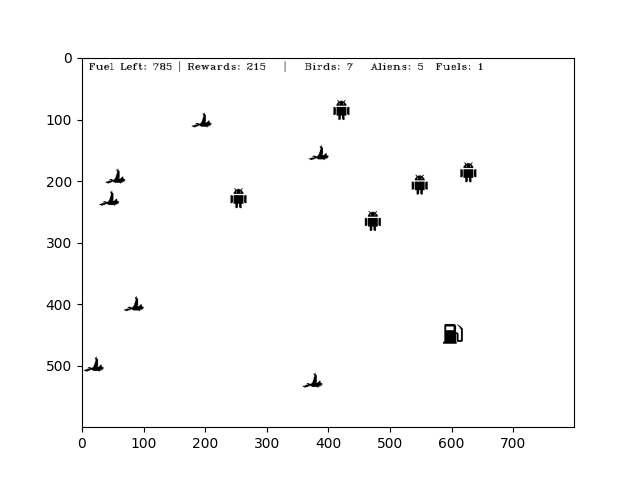

# RL

## Intro

**Custom Env:**

## Reference

**Pytorch official:**

- [REINFORCEMENT LEARNING (DQN) TUTORIAL](https://pytorch.org/tutorials/intermediate/reinforcement_q_learning.html)

**Medium:**

- [Reinforcement Learning 健身房：OpenAI Gym](https://medium.com/pyladies-taiwan/reinforcement-learning-%E5%81%A5%E8%BA%AB%E6%88%BF-openai-gym-e2ad99311efc)
- [Reinforcement Learning 進階篇：Deep Q-Learning](https://medium.com/pyladies-taiwan/reinforcement-learning-%E9%80%B2%E9%9A%8E%E7%AF%87-deep-q-learning-26b10935a745)

**Paperspace:**

- [Getting Started With OpenAI Gym: The Basic Building Blocks](https://blog.paperspace.com/getting-started-with-openai-gym/)
- [Getting Started With OpenAI Gym: Creating Custom Gym Environments](https://blog.paperspace.com/creating-custom-environments-openai-gym/)

**T81-558 Applications of Deep Neural Networks:**

- [Introduction to the OpenAI Gym (12.1)](https://github.com/jeffheaton/t81_558_deep_learning/blob/master/t81_558_class_12_01_ai_gym.ipynb)
- [Introduction to Q-Learning for Game Play (12.2)](https://github.com/jeffheaton/t81_558_deep_learning/blob/master/t81_558_class_12_02_qlearningreinforcement.ipynb)
- [Keras Q-Learning in the OpenAI Gym (12.3)](https://github.com/jeffheaton/t81_558_deep_learning/blob/master/t81_558_class_12_03_keras_reinforce.ipynb)
- [Atari Games with Keras TF-Agents (12.4)](https://github.com/jeffheaton/t81_558_deep_learning/blob/master/t81_558_class_12_04_atari.ipynb)
- [Reinforcement Learning for Non-Games TF-Agents (12.5)](https://github.com/jeffheaton/t81_558_deep_learning/blob/master/t81_558_class_12_05_apply_rl.ipynb)
